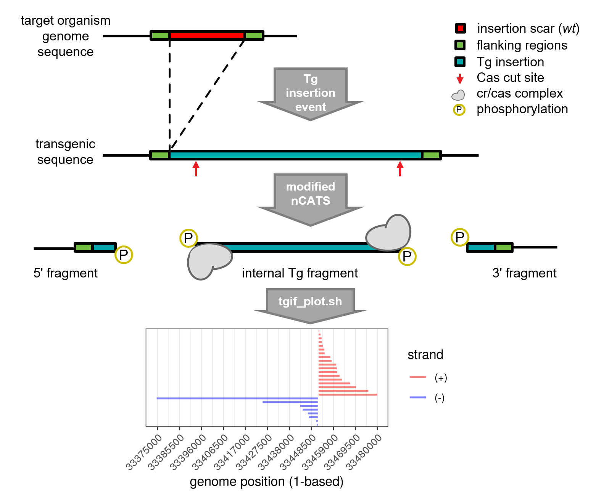

# <a name="intro"></a> TgIF (trans-gene insertion finder)

The TgIF algorithm returns a list of probable insertion sites in a target organism. It requires the user to provided a FASTQ file of ONT (Oxford Nanopore Technologies) reads (-f), the reference FASTA of the trans-gene (Tg) vector containing the insertion sequence (-i), and the reference FASTA of the target organism (-r). The algorithm is tailored for ONT reads from a modified [nCATS](https://www.nature.com/articles/s41587-020-0407-5?proof=t)<sup>[\[1\]](https://github.com/jhuapl-bio/TgIF#refs)</sup> (nanopore Cas9-targeted sequencing) enriched library, however the algorithm will also produce informative results from a FASTQ derived from WGS (shotgun) sequencing libraries. The modified nCATS method is described [here](http://placeholderFORourMS), and a brief overview can be found [below](https://github.com/jhuapl-bio/TgIF#mod_ncats).

The basic workflow of TgIF is alignment (using [minimap2](https://github.com/lh3/minimap2)<sup>[\[2\]](https://github.com/jhuapl-bio/TgIF#refs)</sup>) of reads (-f) to a combined reference of the Tg vector (containing the desired insertion sequence) and target organism (ie. -i and -r are concatenated), and then searching for valleys (or gaps) in the resulting pileup of reads that map to _both_ references at MAPQ>=30. A starting position \(p<sub>s</sub>\) of a valley is where the depth (d) at d<sub>p</sub>=0 and d<sub>p-1</sub>>0, an ending position \(p<sub>e</sub>\) of a valley is where the depth at d<sub>p</sub>=0 and d<sub>p+1</sub>>0, and a potential insertion scar is the gap between and including p<sub>s</sub> and p<sub>e</sub>.

Pseudocode:
1. Due to potential sequence homology between the vector and target genome sequences, reads are aligned to a minimap2 index containing both
2. Alignments with MAPQ<30 are discarded, and resulting alignments are then down-selected for the best per read alignment based on highest MAPQ score
3. Use changes in read depth as indication of insertion site:
	- find gaps in both forward (5' to 3') and reverse (3' to 5') directions
	- ensure each forward gap location (+strand) has a match in reverse (-strand)
	- find rows where gap length and flanking depths are both >0
	- these are the _potential_ insertion sites, likely most will have flanking position depths of 1 and the gap length will be large (>5000 bp)
4. Filter and apply confidence estimate to detected sites based on flanking depth and strandedness of aligned reads (see [output format](https://github.com/jhuapl-bio/TgIF#output_format) col11 for details)

### <a name="installation"></a> INSTALLATION

Clone this github repository in a desired local directory and install dependencies available though the apt repo:
```
git clone https://github.com/jhuapl-bio/TgIF
apt install parallel	#required
apt install primer3		#optional
```

Required dependencies:
- [GNU Parallel](https://www.gnu.org/software/parallel/)<sup>[\[2\]](https://github.com/jhuapl-bio/TgIF#refs)</sup>
- [minimap2](https://github.com/lh3/minimap2#install)<sup>[\[3\]](https://github.com/jhuapl-bio/TgIF#refs)</sup>

Optional dependencies:
- [samtools](https://samtools.github.io/bcftools/howtos/install.html)<sup>[\[4\]](https://github.com/jhuapl-bio/TgIF#refs)</sup>
- [R](https://cran.r-project.org/)<sup>[\[5\]](https://github.com/jhuapl-bio/TgIF#refs)</sup> with [ggplot2](https://ggplot2.tidyverse.org/)<sup>[\[6\]](https://github.com/jhuapl-bio/TgIF#refs)</sup> package (if using plotting module)
- [Primer3](http://primer3.org/manual.html)<sup>[\[7\]](https://github.com/jhuapl-bio/TgIF#refs)</sup> (if using the Primer3 module, symlink the `primer3_core` command to bin)

After installing the above dependencies symlink executables to tgif's `bin` directory. An example for minimap2 using `which` to find the executable path from the globally accessible command, is below:

Symlink (`ln -s`)example:
```
mm2path=$(which minimap2)
binpath="/data/apps/tgif/bin/"
ln -s $mm2path $binpath
```
###  <a name="inputs"></a> INPUT ARGUMENTS & SIMPLE EXAMPLE

Help messages:
```
	-h	help	show help message
	-o	format	show format info for primary tsv output
```
Required inputs:
```
	-t	INT		number of threads to GNU parallel over
	-f	FASTA/Q	sequencing reads file (ideally from an ONT nCATS enriched library
	-r	FASTA	fasta reference of target organism (may contain multiple sequences, no linebreaks within each sequence)
```

Optional inputs:
```
	-i	FASTA	fasta of plasmid/inserted gene(s), HIGHLY recommended (may only contain a single sequence, no linebreaks within the sequence)
	-s	y/n		output sorted bam of downselected reads for IGV use
	-p	y/n		generate read pileup png with R/ggplot2 per insertion site
```

<a name="inputs_example"></a> _Example_
```
f="/data/project/reads.fastq"
r="/data/project/org_reference.fna"
i="/data/project/vector.fasta"
bash tgif_ncats.sh -t 10 -f "$f" -r "$r" -i "$i"
```
_The output from running the command above will be in a directory named for the basename of `$f`, and in the same parent directory of the input FASTA/Q read file. The output dir would be `/data/project/tgif_ncats-reads.fastq/`, and the primary output file is `insertions_filtered.tgif` which is TSV formatted._

### <a name="output_format"></a> PRIMARY OUTPUT FORMAT (`insertions_filtered.tgif`)
All positions are 1-based.
```
col1	HEADER					sequence header from reference [-r] input file where insertion site is predicted
col2	GAP_START				position in reference sequence where gap starts (5' end of gap)
col3	PREGAP_DEPTH			depth of ("position in col2" - 1)
col4	PREGAP_PSTRANDEDNESS	comma separated values: positive strand count, total pregap read count, pos proportion
col5	PREGAP_NSTRANDEDNESS	comma separated values: negative strand count, total pregap read count, neg proportion
col6	GAP_END					position in reference sequence where gap ends (3' end of gap)
col7	POSTGAP_DEPTH			depth of ("position in col6" + 1)
col8	POSTGAP_PSTRANDEDNESS	comma separated values: positive strand count, total postgap read count, pos proportion
col9	POSTGAP_NSTRANDEDNESS	comma separated values: negative strand count, total postgap read count, neg proportion
col10	GAP_LENGTH				length (bp) of deletion (gap, depth zero to zero; col3-col2)
col11	CONFIDENCE				[low], [medium], or [high] probability of being an insertion site
							low - sites where at least one flanking depth is >2
							medium - flanking depths are both >2
							high - flanking depths are both >2, and both flanks have 100% opposing strandedness, e.g. if one flank has 100% of reads aligning to the +strand, then 100% of reads from the other align to the -strand (depending on depth, these are almost definitively insertion sites)
								*if using shear (WGS) data, 'high' confidence is not as meaningful (and anyways, very unlikely)
```
#
### ADDITIONAL MODULES
**Plotting Module**

If interested in a visualization of the read pileups at each potential insertion site, use the optional plotting parameter (`-p y`) in the primary TgIF script (`tgif_ncats.sh`), or use the separate plotting script (`tgif_plot.sh`) which takes as input, the path to an output directory of the primary TgIF script (as it requires some intermediate files produced during the TgIF process).

Usage of separate script, using inputs from [example](https://github.com/jhuapl-bio/TgIF#inputs_example) above:
`bash tgif_plot.sh /data/project/tgif_ncats-reads.fastq/`


**Primer3 Module**

The TgIF Primer3 module (`tgif_primer3.sh`) is used to design primers for wet lab validation of potential insertion sites identified by the primary TgIF script (`tgif_ncats.sh`). For each potential insertion site reported in the TSV output file, files named for the reference sequence header and the start and end positions of the gap (col2 and col6) will be output. There will be separate files for the forward and reverse primers (in default Primer3 output format).

These will be designed from a template sequence derived from the target genome reference (-r) 500 bp upstream/downstream of the gap start/end positions, respectively (i.e. col2-500 and col6+500). Since the _wild-type_ sequence will be present in the reference, this part of the template will be masked (ignored) during the design process (i.e. a number of positions equaling the gap length {col10} is masked in the template sequence starting at position 500). It is assumed the user will have a matching reverse or forward primers which are within the insert to match with either the flanking forward and reverse target genome primers output by this module, respectively. These (or any number of other primers output by this module) may be used in separate reactions as validation assays for predicted insertion sites.

Please see [Installation](https://github.com/jhuapl-bio/TgIF#installation) section for dependency details.

INPUT ARGUMENTS & SIMPLE EXAMPLE
Help messages:
```
-h      help	show this message
-f		format	format of input (insertions_filtered.tgif)
```
Required inputs:
```
-t	INT		number of threads to GNU parallel over
-i	TgIF	full path to output file of primary tgif algorithm (insertions_filtered.tgif)
-r	FASTA	fasta reference of target organism used to generate the input file (-i)
```
Optional inputs:
```
-g	INT		if GAP_LENGTH (col10) of insertion site is greater than INT bp (-g), no primers will be generated for the site [default 5000]
```

_Example (following the same primary TgIF script [example](https://github.com/jhuapl-bio/TgIF#inputs_example))_
```
i="/data/project/tgif_ncats-reads.fastq/insertions_filtered.tgif"
r="/data/project/org_reference.fna"
bash tgif_primer3.sh -t 10 -i "$i" -r "$r" -g 2000
```
_The output directory (named `primer3_files`) will be **in** the parent directory of the input file (-i), in this case it will be `/data/project/tgif_ncats-reads.fastq/primer3_files`. Expanding the output directory with `tree` you can see examples of the naming conventions, and `head` of the first `.for` file (containing a list of possible forward primers) gives a flavor of the Primer3 output format (for details, query column headers at http://primer3.org/manual.html):_
```
tree primer3_files/
primer3_files/
├── Chr07-2128004-2128032.for
├── Chr07-2128004-2128032.rev
├── Chr08-33451539-33451905.for
├── Chr08-33451539-33451905.rev
├── log
├── p3record.tgif_aa
├── p3record.tgif_ab
├── parallel.p3
├── tgif
├── tgif_aa
└── tgif_ab

0 directories, 11 files
```
```
head primer3_files/Chr07-2128004-2128032.for 
ACCEPTABLE LEFT PRIMERS
                                  0-based     #                self   self hair-  qual-
   # sequence                       start ln  N   GC%     Tm any_th end_th   pin   lity
   0 AGGAAAGCGAGTCCAAGAGC             185 20  0 55.00 60.037  6.20  0.00 37.65  0.037
   1 CCCCGTTTGGATCCTTGGAA              38 20  0 55.00 59.961 14.23  0.00 37.49  0.039
   2 CGAGTCCAAGAGCGTGCTAT             192 20  0 55.00 59.899  0.00  0.00  0.00  0.101
   3 TTTCCCTTAGGCCCCGTTTG              27 20  0 55.00 60.251  0.00  0.00  0.00  0.251
   4 TGGAATGTACCCTGCAGCAA             437 20  0 50.00 59.596  8.66  0.00  0.00  0.404
   5 CTTAGGCCCCGTTTGGATCC              32 20  0 60.00 60.466  4.20  4.20 37.49  0.466
   6 CCTTAGGCCCCGTTTGGATC              31 20  0 60.00 60.466  0.00  0.00 37.49  0.466

```

### <a name="mod_ncats"></a> Modified nCATS Method (more details [here](http://placeholderFORourMS))

The [nCATS](https://www.nature.com/articles/s41587-020-0407-5?proof=t) method was originally designed for interrogation of a known genomic region. For application to enrichment of reads from an unknown transgene (Tg) insertion site in a target organism, the ends of the Tg are targeted with the guides (CRISPR gRNA), leaving enough of the Tg sequence for specific alignment (gRNA homology indicated by red arrows), and oriented such that after cleavage the cas9 will sit on the internal Tg fragment instead of at each end of the flanking sequences.



These digested fragments will be more amenable for ONT library prep due to the resulting phosphorylation end prep, while library preparation of the internal fragment is hindered by the remaining large cr/cas complex. Additionally, any of these uninformative reads derived from this fragment will be filtered post-alignment since they will only align to the vector sequence. The resulting enrichment of flanking reads helps identify the genomic context of insertion sites via the method described [above](https://github.com/jhuapl-bio/TgIF#intro). Note that (-) strand reads are expected from the 5' fragment and (+) strand reads are expected from the 3' fragment in the example shown in the figure due to the strandedness of the gRNAs.


#
### Some helpful notes:
- please use full paths for file/directory input arguments
- all reference files (-r and -i) should have only 2 lines per sequence (i.e. no newlines [\n or \r] within the sequence)
- there can be multiple sequences in (-r), but there should only be a single sequence in (-i)
- FASTQ input (-f) should be from a modified nCATS enriched library, however may be from a WGS sheared library (however this renders the confidence estimates less useful)
- all 'process comments' output to command line are coming from stderr output (i.e. will not redirect with stdout '>'), they are also printed to a log file
- the insertion sites will be printed to stdout, and are also saved in the output directory in the file `insertions_filtered.tgif`
- all reported genome positions are 1-based
- output directory will be created where the input read file (-f) exists, named for the basename of the read file (i.e. `tgif_ncats-$(basename $f)`)


#
### <a name="refs"></a> REFERENCES
1. Gilpatrick, T. _et al._ Targeted nanopore sequencing with Cas9-guided adapter ligation. [_Nature Biotechnology_ **38**, 433–438 (2020)](https://www.nature.com/articles/s41587-020-0407-5?proof=t).
2. Li, H. (2018). Minimap2: pairwise alignment for nucleotide sequences. Bioinformatics, 34:3094-3100. [doi:10.1093/bioinformatics/bty191](https://doi.org/10.1093/bioinformatics/bty191)
3. O. Tange (2011): [GNU Parallel](https://www.gnu.org/software/parallel/) - The Command-Line Power Tool, ;login: The USENIX Magazine, February 2011:42-47.
4. Li H, Handsaker B, Wysoker A, Fennell T, Ruan J, Homer N, Marth G, Abecasis G, Durbin R, and 1000 Genome Project Data Processing Subgroup,  **The Sequence alignment/map (SAM) format and SAMtools**,  _Bioinformatics_  (2009) 25(16) 2078-9 [[19505943](http://www.ncbi.nlm.nih.gov/pubmed/19505943)]
5. R Core Team (2013). R: A language and environment for statistical computing. R Foundation for Statistical Computing, Vienna, Austria. URL http://www.R-project.org/.
6. H. Wickham. [ggplot2](https://ggplot2.tidyverse.org/): Elegant Graphics for Data Analysis. Springer-Verlag New York, 2016.
7. Untergasser A, Cutcutache I, Koressaar T, Ye J, Faircloth BC, Remm M and Rozen SG. [Primer3](http://primer3.org/manual.html)--new capabilities and interfaces. Nucleic Acids Res. 2012 Aug 1;40(15):e115.


